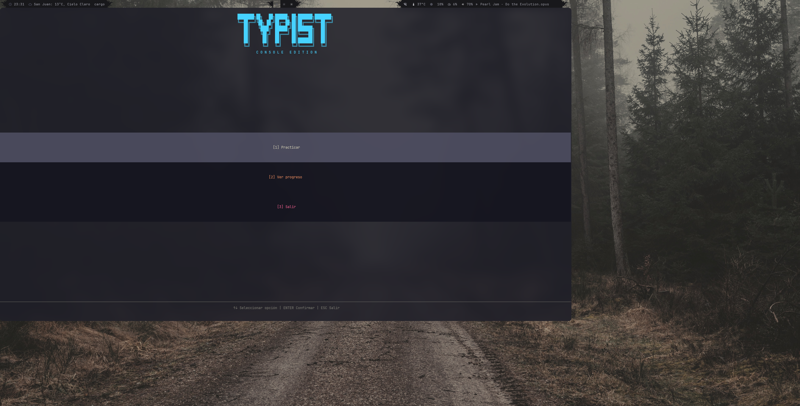
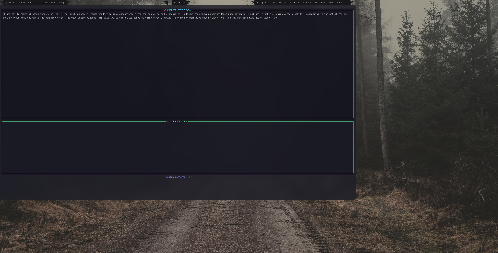
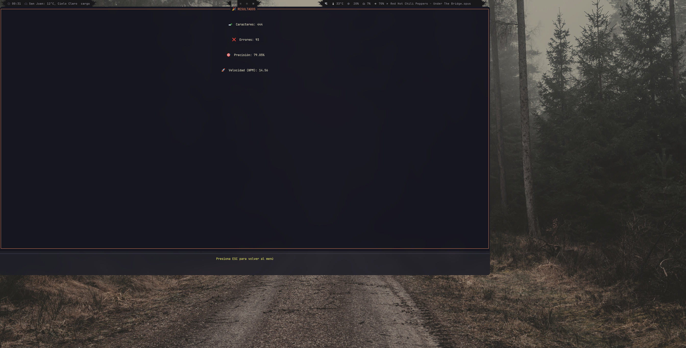

<h1 align="center">Typist Console 🧠⌨️</h1>

  <strong>typist_console</strong> es una aplicación de práctica de mecanografía para terminal, escrita en Rust.

   Menú de inicio 
  
   Sesión de práctica 
  
   Estadísticas de sesión 
  

Nace de mi interés por mejorar mis habilidades de mecanografía. 
Decidí crear una herramienta que permitiera practicar de manera efectiva y divertida  
directamente en la terminal, donde paso la mayor parte de mi tiempo programando.

Opté por Rust por su rendimiento y seguridad, características que 
lo convierten en un lenguaje ideal para este tipo de aplicaciones. 
Además, aproveché el proyecto para aprender Rust y utilizarlo en mi entorno Linux.

<h2>Objetivo principal</h2>

Ayudar a mejorar la velocidad y precisión al escribir 
mediante ejercicios prácticos con retroalimentación inmediata.

<h2 align="center">Próximas características ✨</h2>

- Integración con IA para sugerir correcciones 
- Personalización de ejercicios basada en el progreso 
- Generación de informes detallados de evolución

